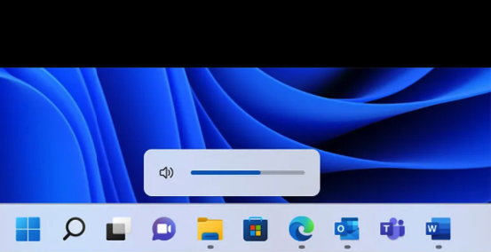
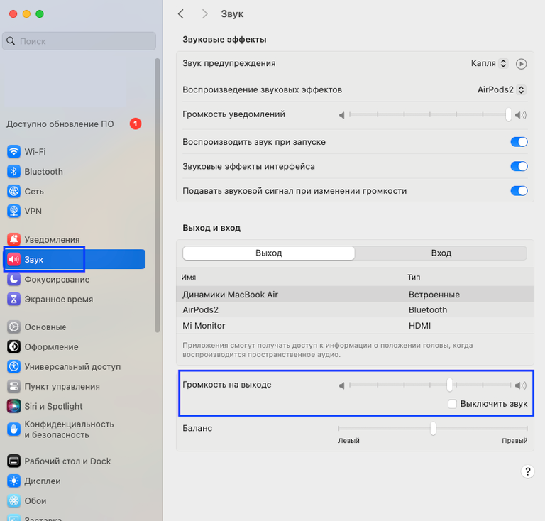
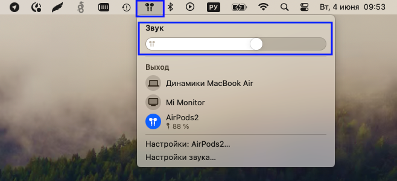

Перед началом работы необходимо проверить уровень громкости звука на устройстве

[tabs]

[tab:Windows]

Для того, чтобы изменить уровень громкости в системе:

1. На панель управления нажмите "Звук".

2. Выберите Свойства устройства.

3. Выберите вкладку «Уровни» и установите уровень.

{width=553px height=284px}

[/tab]

[tab:Mac OS]

Для того, чтобы изменить уровень громкости в системе, необходимо открыть настройки, выбрать "Звук"-"Громкость на выходе".

{width=768px height=734px}

Также можно это сделать из командной строки, выбрав источник звука.

{width=658px height=301px}

[/tab]

[/tabs]