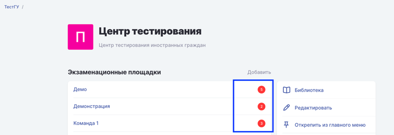
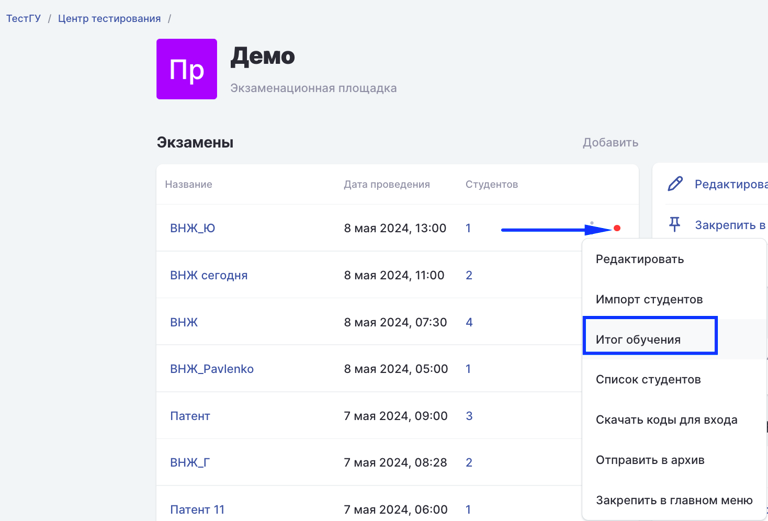

На странице со списком площадок указано количество экзаменов, которые требуют проверки.

{width=768px height=264px}

После открытия страницы площадки индикатор подскажет, где необходимо проверить цифровой след следующего и выставить итог.

{width=768px height=521px}

Проверяющие  Томского государственного университета будут видеть **индикаторы непроверенных экзаменов и выставлять итог по каждому**.