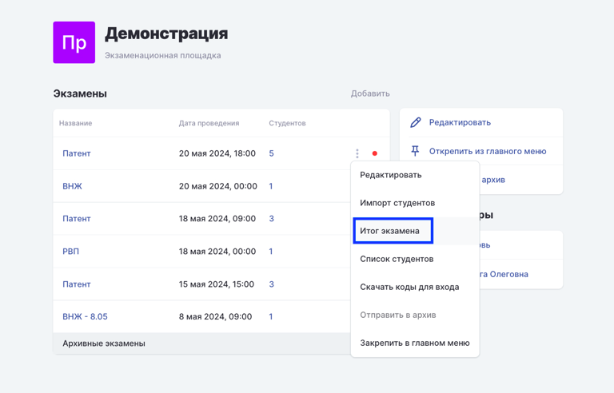
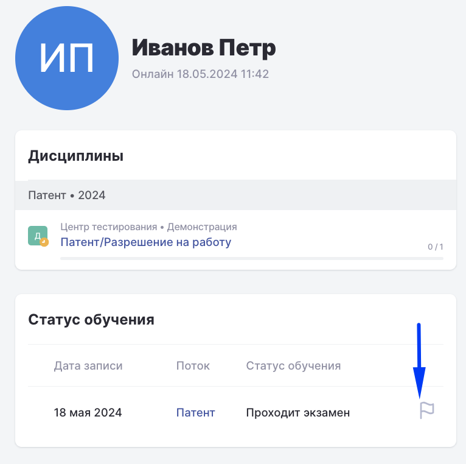
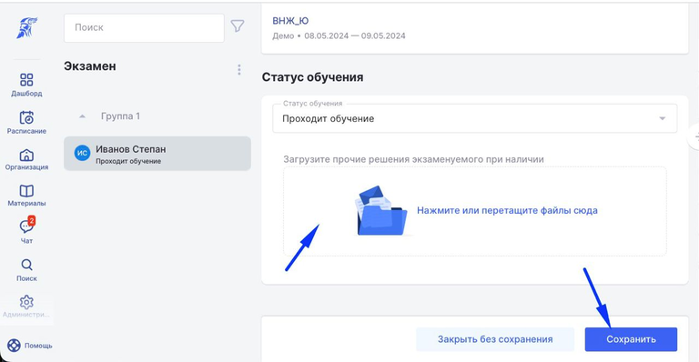

Иногда в экзаменах на Патент/Разрешения на работу требуется записать отдельно Видеовизитку, например сдающий пропустил представление или плохо показал паспорт

Отдельный видеофайл необходимо загрузить на странице **Итога экзамена.**

:::info 

Загрузка доступна администраторам площадок.

:::

 **1\.** Открыть страницу Итога экзамена можно 2-мя способами:

-  из списка экзаменов -> три точки -> Итог экзамена

-  со страницы профиля сдающего -> блок "Статус обучения" -> кликнуть по "Флажку"

[tabs]

[tab:Из списка экзаменов]

{width=768px height=492px}

[/tab]

[tab:Со страницы профиля сдающего]

{width=766px height=762px}

[/tab]

[/tabs]

 **2\.** Выбрать сдающего (кликнуть по ФИО, если он пока не выбран) в списке, перетащить видеовизитку и сохранить.

{width=768px height=398px}