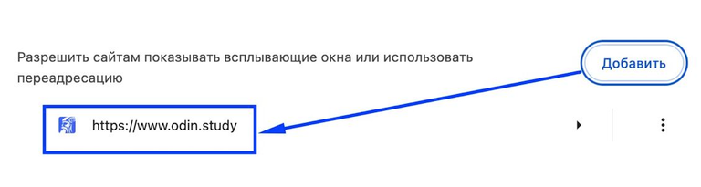
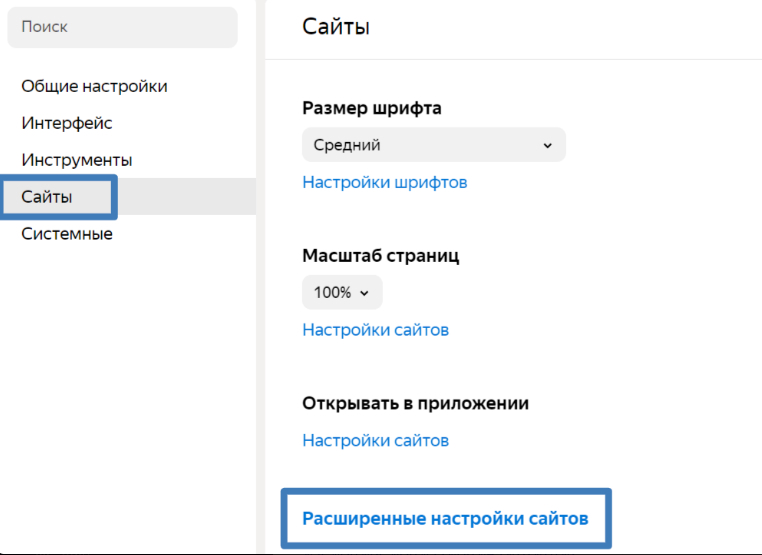
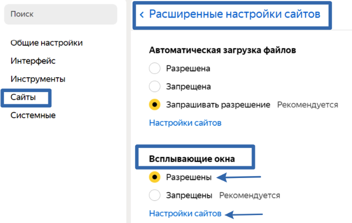

Для того, чтобы разрешить <https://www.odin.study/> показывать всплывающие окна, необходимо:

[tabs]

[tab:Google Chrome]

Перейти в Настройки -> Конфиденциальность и безопасность -> Настройки сайта -> Всплывающие окна и переадресация и добавить <https://www.odin.study/>

{width=768px height=205px}

[/tab]

[tab:Яндекс.Браузер]

В Яндекс браузере открываем «Настройки», раздел «Сайты» и кликаем на пункт "Расширенные настройки сайтов". Находим пункт «Всплывающие окна» и ставим точку напротив «Разрешены» и нажимаем «Настройки сайтов», добавляем <https://www.odin.study/>

{width=762px height=555px}

{width=711px height=451px}

[/tab]

[/tabs]