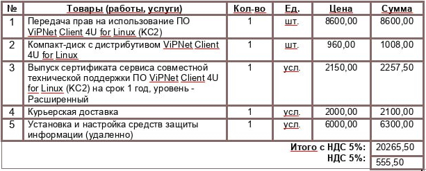

Да, для безопасного доступа к информационной системе Flow необходимо использовать сертифицированные средства криптографической защиты информации (СКЗИ), такие как ViPNet Client. Обоснование необходимости использования СКЗИ Нормативная база:

Пункт 13 Постановления Правительства РФ от 1 ноября 2012 г. № 1119 прямо требует применения средств криптографической защиты информации, прошедших оценку соответствия

Приказ ФСТЭК России № 21 от 18 февраля 2013 г. (пункт 8.13, мера ЗИС.3) устанавливает обязательность защиты информации при передаче по сетям связи

Приказ ФСБ России № 378 от 10 июля 2014 г. определяет требования к криптографической защите информации Протокол HTTPS с использованием TLS не является сертифицированным СКЗИ в соответствии с российским законодательством

Требования по защите информации распространяются на весь канал передачи персональных данных, включая участок до рабочего места пользователя

Использование сертифицированных СКЗИ обязательно для обеспечения конфиденциальности и целостности передаваемых персональных данных Заключение: В соответствии с установленными требованиями законодательства, для безопасной работы с информационной системой Flow, обрабатывающей персональные данные, необходимо использование сертифицированных средств криптографической защиты информации, таких как ViPNet Client. Это является обязательным условием соблюдения требований Федерального закона № 152-ФЗ "О персональных данных" и подзаконных актов.

Примерная стоимость подключения (не является публичной офертой).

Для ОС Windows

{width=621px height=270px}

Для ОС Linux

{width=613px height=247px}